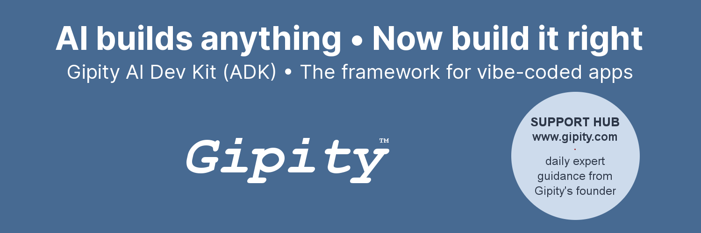

# Gipity AI Dev Kit (ADK)

[](https://github.com/gipity/gipity-core-adk/stargazers)

<p align="center">  <a href="https://www.gipity.com"></a></p>

## Project Overview

**Gipity AI Dev Kit (ADK)** gives you a **production-ready foundation** for building full-stack web, PWA, and native iOS/Android apps, with Supabase integration for **auth, database, and file storage** all set up from day one from a single codebase.

Instead of starting from scratch, Gipity provides:

* A pre-built, **Supabase-ready architecture**
* **Secure APIs** for your app logic
* **Dev/prod switching** for real-world deployment
* **1-click native build preparation** for iOS & Android via Ionic Appflow

Built for AI-assisted coding, but with **best practices baked in** so your app launches fast — and right.

**Built with:** Replit • Supabase • Ionic Appflow • React • TypeScript • Tailwind CSS • Vite • Capacitor

Further details on the **Gipity AI Dev Kit (ADK)** and optional **Support Hub** at [www.gipity.com](https://www.gipity.com).

---

## Quick Links  

- [Features & Tech Stack](#features--tech-stack)  
- [Getting Started](#-getting-started---a-complete-setup-guide)  
- [Security Notes](#security-notes)  
- [Support & Community](#support--community)  
- [Contributing](#contributing)  
- [License](#license--fair-use)  

---

## Features & Tech Stack

### 🔐 Built-in User System

* **Authentication & roles** with Supabase Auth
* **Email verification & password resets** included out of the box
* **JWT-based access** for secure API endpoints

### 🗄️ Data & Files, Your API

* **Postgres DB** with row-level security (RLS) enabled
* **Supabase storage buckets** for images & downloads
* **Secure APIs** protected by roles & tokens

### 📱 Mobile & PWA Ready

* **Installable PWA** that works offline, no App Store needed
* **1-click native builds** for iOS & Android via Appflow
* **Native plugins** for camera, media, and safe areas

### ⚡ Dev & Deployment

* **Runs instantly** in Replit or GitHub with full stack support
* **Dev/prod switching** built-in via environment variables
* **Auto-generated assets** for iOS/Android launch screens & icons

### 🛠️ Modern Tech Stack

* **React + TypeScript + Tailwind** UI
* **Supabase backend** for auth, DB, storage
* **Configurable via Replit Secrets** for smooth dev/prod setup

### 📬 Email & Messaging

* **SMTP-ready** email integration
* **Supabase email via SMTP** for notifications & onboarding

### 👥 Community & Support (optional)

* **Private Support Hub** for Q\&A and guidance
* **AI-ready prompts** for extending your app with new features

---

## 🚀 Getting Started - A Complete Setup Guide

> **TL;DR:** Use this repo as a template → import to Replit → add Supabase + SMTP secrets → run the setup SQL → build native apps via Ionic Appflow.

---

**Need help using the *Gipity AI Dev Kit (ADK)***? [**Join the Support Hub**](https://www.gipity.com)

**Relying on other tools:** Setup steps may change if third-party tools update their dashboards or flows. Check official docs if you hit a mismatch.

**First time users**: These steps should be done in the order shown.

**Note**: where you are asked to add a phrase or name, e.g. `[APPNAME]` replace this (and any square brackets) with an actual value, e.g. `my-chatgpt-clone`.

---

### Prerequisites

For building all apps:
- [Replit](https://replit.com) (Core or Teams)
- [Supabase](https://supabase.com) (Free tier)
- [GitHub](https://github.com) (Free)

For building native mobile apps:
- [Apple Developer Account](https://developer.apple.com) ($99/year) for iOS builds
- [Google Play Developer Account](https://play.google.com/console) ($25 one-time) for Android builds
- [Ionic Appflow](https://ionic.io/appflow) (PAYG) for native app builds
- Keychain Access (Free, built in to Macs) create Apple certificates
- [OpenSSL](https://slproweb.com/products/Win32OpenSSL.html) (Free, Windows users) create Apple certificates
- [Temurin](https://adoptium.net/en-GB/temurin/releases) (Free) create Android certificates
- [UDID Tech](https://udid.tech) (Free) get your iPhone's UDID id
- [Diawi](https://www.diawi.com) (Free) copy code to iPhone

---

### **Setup Your iPhone and Apple and Android Developer Accounts**

1. **Enable Your iPhone for App Testing**
   - Add your iPhone's UDID as a new device (use https://get.udid.io on your iPhone to obtain this)
   - Switch your iPhone to developer mode by going to Settings -> Privacy & Security -> Developer Mode and toggling this to ON. Confirm the message asking if you want to restart your device. After your iPhone restarts, a prompt will appear asking if you want to enable Developer Mode. Tap Turn On and enter your device passcode to confirm

2. **Prepare for Creating Your Apple "Development" Apps**
   - If you don't already have an Apple Developer account, create one at [developer.apple.com](https://developer.apple.com) for $99/year (can take 24-48 hours)
   - Create your csr, cer and `p12` development certificates (use Keychain Access on Mac, or OpenSSL on Windows). Store these generated files and the p12 password safely
   - Create two *App ID* identifiers for your app: `com.yourcompany.yourapp` and `com.yourcompany.yourappdev` (must be `dev` at the end)
   - Create an *iOS App Development* provisioning profile for your app and iPhone (using its unique UDID), for `com.yourcompany.yourappdev`. This is your **iOS development provisioning profile**
   - Create an *iOS App Development* provisioning profile for your app and iPhone (using its unique UDID), for `com.yourcompany.yourapp`. This is your **iOS production provisioning profile**

3. **Prepare for Creating Your Google Play "Release" Apps**
   - If you don't already have an Android Developer account, create one at [play.google.com/console](https://play.google.com/console) for a $25 one-time registration fee
   - Create your `keystore` release certificate (use Android Studio or Temurin JDK/keytool on Mac and Windows). Store your keystore password and the generated file safely

---

### **Setup GitHub Account and Prepare Repositories**

1. **Get Your Own Copy of the Gipity AI Dev Kit (ADK) code**
   - If you don't already have a GitHub account, create a free one at https://github.com
   - Go to [Gipity on GitHub](https://github.com/gipity/gipity-core-adk) and click `Use this template` then `Create a new repository`
   - Set your new repository name as you wish (e.g. `my-new-app`) and set to private or public based on preference. Click `Create repository`

2. **Create a Mobile Build Repository**
   - Create a 2nd repository in your GitHub account called: `[my-new-app]-appflow`
   - Keep it empty for now (don't initialize with README) and set to private

---

### **Create Replit App Using the Gipity AI Dev Kit (ADK)**

1. **Import Gipity Repo**
   - If you don't already have a Replit account, create a Core or Teams account at [Replit](https://replit.com/)
   - Open Replit and connect your GitHub account in the `Account Settings` page
   - Click `Import code or design` -> `GitHub`, select the name of your GitHub repo (e.g. `my-new-app`) and set Privacy to Internal
   - Click `Import from GitHub` and the AI Agent tool will begin building your app using your copy of the Gipity AI Dev Kit (ADK)

2. **Setup Your Initial App**
   - The Replit AI Agent should recognise that you need to add some secrets for Supabase. Do not enter them in the Agent screen
   - Open the Secrets tool and click the `Edit as .env` button. Paste the entire secrets block below, replacing with your own values where applicable, and following these additional instructions:
      - SMTP: these are used to allow the app to send emails. Use your own email account details. Use placeholder values for now if you do not have access to these details, but note the Gipity AI Dev Kit (ADK) demo will not be able to send a welcome email when you sign up
      - APPFLOW_REPO_URL: this should be the empty repo you setup that ends with "-appflow", e.g. `my-new-app-appflow`
      - APP_NAME: keep this short, it is what will appear on your mobile devices home screen (Note: it will automatically add `dev` to the end)
      - APP_ID: this must match what you setup in the Apple developer dashboard and conform to the format shown
      - CUSTOM_DOMAIN: you must add `https://`. this is the long development URL in the Replit development environment. But switch it to the deployed URL in the deployment secrets (if you have your own bespoke domain use this, otherwise use the Replit deployed domain)
      - PROD_BACKEND_URL: keep the placeholder value for now, as it will be updated later. do not add `https://`. This is always the deployed domain name, not the development one. If you have your own bespoke domain use this, otherwise use the Replit deployed domain
      - SUPABASE: keep these as the placeholder values for now, as they will be updated later

```bash
APP_OWNER_EMAIL="myname@gipity.com"
SMTP_SENDER_EMAIL="myname@mydomain.com"
SMTP_SENDER_NAME="my name"
SMTP_HOST="my-mail-server.mydomain.com"
SMTP_PASS="my-mail-server-password"
SMTP_PORT="587"
SMTP_USER="my-mail-server-username"

APP_PRIMARY_COLOR="#476a92"
APP_PRIMARY_DARK_COLOR="#2d4a6b"
APP_ACCENT_COLOR="#476a92"
APP_SPLASH_BACKGROUND_COLOR="#ffffff"

GITHUB_USERNAME="MY-GITHUB-USERNAME"
APPFLOW_REPO_URL="MY-GITHUB-MOBILE-BUILD-REPO-FOR-APPFLOW"

VITE_SHOW_DEBUG_CONSOLE="true"
VITE_DO_CONSOLE_LOGGING="true"
DO_CONSOLE_LOGGING="true"
REPLIT_PROD_DOMAIN_ACCESS="true"

APP_DESCRIPTION="This is my app description"
VITE_APP_DESCRIPTION="This is my app description"

VITE_CACHE_NAME="myappnohypensorspaces"
CACHE_NAME="myappnohypensorspaces"
APP_SCHEME="myappnohypensorspaces"
APP_USER_AGENT="myappnohypensorspaces"

VITE_APP_NAME="My AppName"
APP_NAME="My AppName"

APP_ID="com.mybizname.app"

CUSTOM_DOMAIN="https://[RELEVANT-DOMAIN-NAME.COM]"

PROD_BACKEND_URL="PLACEHOLDER-UPDATE-LATER.replit.app"

SUPABASE_URL="https://PLACEHOLDER-UPDATE-LATER.supabase.co"
SUPABASE_SERVICE_ROLE_KEY="PLACEHOLDER-UPDATE-LATER"
SUPABASE_ANON_KEY="PLACEHOLDER-UPDATE-LATER"
```

   - Save your new secrets once you have edited them
   - Return to the Agent tool and give it the following prompt:
      > "I have provided the Supabase and other secrets directly in the secrets tool. Now proceed with setting up the new app"
   - Give Agent the following prompt to fix a common issue with installing the new Gipity AI Dev Kit (ADK) app:
      > "the Gipity AI Dev Kit app has a script gipity-image-resizer.py which requires the PIL/PILLOW module. Please install this if it isn't already"

3. **Gipity AI Dev Kit (ADK) App is Installed**
   - Congratulations, your initial Gipity AI Dev Kit (ADK) app is installed, and ready for the next configuration and build stages

### **Setup Supabase Account and Configuration**

Steps 1 to 4 will setup a Supabase project to work alongside your Replit development app. Step 5 is to repeat them for creating a 2nd project for your deployed production app (can be left until later).

1. **Create Account and "Development" Project**
   - If you don't already have a Supabase account, create a free one at [supabase.com](https://supabase.com)
   - Create a new project called "development" (we recommended choosing a US region to be closest to the Replit servers)
   - The following are optional, but highly recommended configuration settings, especially for new Supabase users:
      - Authentication -> Email: Configure settings to send emails via your own SMTP mail server. Set the `Minimal interval between emails being sent` to "5". If you do not have access to these details then use the Supabase emailing option instead for now, but note there are some restrictions with the throughput/volume of emails you can send
      - Authentication -> Signin/Providers: Ensure only `Email` is selected and its `Email OTP Expiration` setting is "3600"
      - Authentication -> Rate Limits: Set `Rate limit for sending emails` to "240"
      - Authentication -> URL configuration: Set `Site URL` to be your long development URL from the Replit development environment, e.g. `https://LONG-URL.replit.dev`
      - Authentication -> Users -> Add User -> Create new user: add your own email address together with a password you will login to your new app with. Ensure `Auto Confirm User` is ticked

2. **Prepare and Run the Gipity AI Dev Kit (ADK) Setup SQL**
   - Go to the Replit dashboard, open the `gipity-scripts\gipity-supabase-prepare.sql` file and scroll to the bottom. Edit the `first_name`, `last_name` and `email` fields, putting in your own name and email address. Save the file, and then copy the entire contents of the file
   - Return to the Supabase project dashboard -> SQL Editor: Paste the SQL into a new Snippet and run it

3. **Setup Storage Configuration**
   - Go to Storage -> "files" (this bucket was created in the previous step) -> Edit bucket
   - Verify the bucket is public. Save the settings

4. **Configure Replit to Point at Your New Supabase Project**
   - Go to the Replit dashboard and open the secrets tool
   - Go to the Supabase dashboard -> Project settings -> Data API: Copy the `project URL` and paste this into the Replit `SUPABASE_URL` secret
   - Go to the Supabase dashboard -> Project settings -> API Keys (legacy): Copy the `service_role` and paste this into the Replit `SUPABASE_SERVICE_ROLE_KEY` secret value
   - Go to the Supabase dashboard -> Project settings -> API Keys (legacy): Copy the `anon public` and paste this into the Replit `SUPABASE_ANON_KEY` secret value
   - Ensure the Replit secrets are all saved if you were using the `Edit as .env` button

5. **Repeat above for the Supabase "Production" Project** (optionally leave until you are ready to deploy your new Replit app to production)
   - To create a 2nd Supabase project for your deployed production app, repeat steps 1 to 4, with the following notes:
      - Call the new project "production"
      - Authentication -> URL configuration: Set `Site URL` to be your deployed URL **not the long development URL**. If you have your own bespoke domain use this, otherwise use the Replit deployed domain, e.g. `https://your-subdomain.replit.app`
      - Edit the deployment secrets, **not the development secrets** to add the project URL, service_role and anon keys

---

### **Setup Ionic Appflow Account and Prepare for Build of Native Mobile Apps**

1. **Create Ionic Appflow Account**
   - If you don't already have an Ionic Appflow account, create a free one at [Appflow](https://ionic.io/signup?source=appflow)
   - Go to Personal Settings -> Integrations, and connect your GitHub account
   - Go to Apps and click New App -> Import App
   - Name the app as you wish, set the runtime as `Capacitor`, and click Continue to choose your app's git host repository
   - Choose `[my-new-app]-appflow` in the repository list and click Next. Do not click New Build at this stage

2. **Configure Ionic Appflow Environments**
   - Create "Development" environment with variables:
     ```
     VITE_APP_DESCRIPTION=This is my app description
     VITE_APP_NAME=AppName
     VITE_BACKEND_URL=https://long-replit-development-URL.replit.dev
     VITE_DO_CONSOLE_LOGGING=true
     VITE_SHOW_DEBUG_CONSOLE=true
     ```

   - Create "Production" environment with variables:
     ```
     NODE_ENV=production
     VITE_APP_DESCRIPTION=This is my app description
     VITE_APP_NAME=AppName
     VITE_BACKEND_URL=https://your-subdomain.replit.app
     VITE_DO_CONSOLE_LOGGING=true
     VITE_SHOW_DEBUG_CONSOLE=true
     ```

4. **Add Ionic Appflow Signing Certificates**
   - Create Android "Android Dev+Prod" certificate: Add your `keystore` file, `yourappnamekey` alias and keystore password
   - Create iOS "iOS Dev" certificate: Add your `p12` development certificate and password, together with your **iOS development provisioning profile**
   - Create iOS "iOS Prod" certificate: Add your `p12` development certificate and password, together with your **iOS production provisioning profile**

---

### **Build, Install and Run Your Native Mobile Apps**

1. **Pre-Build in Replit**
   - Open the Workflows tool inside Replit
   - Run the `Gipity Image Resizer+Generation` workflow. This takes the master images in the `master-images` folder and generates 124 different versions to support iOS and Android native apps
   - Run the `Gipity Appflow Prepare (Dev)` workflow. This will build the `gipity-appflow folder`, containing the exact files needed to build the iOS and Android native apps. You will be asked to confirm connection to your appflow repository in GitHub, as it copies the gipity-appflow folder to the repo (emptying any existing contents first)
   - Go to GitHub and refresh the code page for your appflow repo. It should now contain an exact copy of the gipity-appflow folder from Replit. Confirm the latest commit message says `App Appflow Sync (dev)` (i.e. it must not say "(prod)"

2. **Build in Ionic Appflow**
   - Open your app inside Ionic Appflow
   - Click Build -> Builds -> New Build
   - Click on the latest GitHub commit
   - Build iOS app (connected to your `Replit "development" version`): Do not change Build stack. Set Build type to `Development`. Set Signing certificate to `iOS Dev`. Set Environment to `Development`. Click Build. Approx run time is 1-2 minutes. Once the job is completed, click the `Download IPA` link to copy the install file onto your local machine (Mac or Windows. Not on your mobile)
   - Build Android app (connected to your `Replit "development" version`): Do not change Build stack. Set Build type to `Release`. Set Signing certificate to `Android Dev+Prod`. Set Environment to `Development`. Click Build. Approx run time is 5-8 minutes
   - Build iOS app (connected to your `Replit "production" version`. Do this later, once you have deployed your Replit app to production): Do not change Build stack. Set Build type to `Development`. Set Signing certificate to `iOS Prod`. Set Environment to `Production`. Click Build. Approx run time is 1-2 minutes. Once the job is completed, click the `Download IPA` link to copy the install file onto your local machine (Mac or Windows. Not on your mobile)
   - Build Android app (connected to your `Replit "production" version`. Do this later, once you have deployed your Replit app to production): Do not change Build stack. Set Build type to `Release`. Set Signing certificate to `Android Dev+Prod`. Set Environment to `Production`. Click Build. Approx run time is 5-8 minutes

3. **Download, Install and Run Your Native iOS App on Your iPhone**
   - In a browser, go to [Diawi](https://www.diawi.com) on your local machine (Mac or Windows. Not on your mobile)
   - Drag the IPA file to the file upload box on the Diawi website (the file will usually be in your Downloads folder, and with a name such as `my-app-main-d6b0af-development.ipa`)
   - Untick the Diawi options to "Allow your testers to find the app on Diawi" and "Allow Diawi to display the app's icon on the wall of apps", and click Send
   - From your iPhone camera app, scan the QR code and click the URL to open it in Safari (it must open in Safari and no other browser - copy the URL to Safari if needed)
   - A Diawi webpage will open and present an Install link. Click this and you will be prompted to install your new app
   - Close the browser and you will see your new app installed on your home screen
   - If the app name on the home screen is followed by "dev", e.g. "My Appdev", this confirms it is connected to your Replit development environment, rather than the deployed production environment

   - **You now have your very own native mobile iOS app. !!Congratulations!!**

   - You can signup for a new account. Or remember, you have already created an admin user in the Supabase project, so try logging in as this

4. **Download, Install and Run Your Native Android App on Your Android phone**
   - On your Android phone, in a browser go to [Appflow](https://dashboard.ionicframework.com/), login and navigate to your app's build page
   - Click Build -> Builds and then click on the latest Android build to open it. Confirm the job has completed in the logs
   - click the `Download APK` link to copy the install file onto your Android phone
   - The phone will recognise the APK file as an install, and take you through a series of steps to scan the app for security threats and then install it
   - Once the install is complete you will see your new app installed on your home screen
   - If the app name on the home screen is followed by "dev", e.g. "My Appdev", this confirms it is connected to your Replit development environment, rather than the deployed production environment

   - **You now have your very own native mobile Android app. !!Congratulations!!**

   - You can signup for a new account. Or remember, you have already created an admin user in the Supabase project, so try logging in as this

---

## Security Notes
- Do not commit secrets (Supabase keys, SMTP creds) to Git. Use Replit Secrets.
- Never expose API keys in client-side code or public repos.
- If a key is exposed, rotate it in Supabase and update Replit Secrets immediately.
- Never use the Supabase service_role key on the front-end; it’s for back-end/server-side only.

---

## Support & Community

Need help or want to connect with other builders using the **Gipity AI Dev Kit (ADK)**?

* **Join the Support Hub** – Private space for Q\&A, guidance, and feature requests.
* **Ask questions anytime** – Get answers from a seasoned founder with 29 years of startup experience.
* **Share wins and feedback** – Help shape the ADK with your ideas and feature requests.

[**Join the Support Hub**](https://www.gipity.com)

---

## Contributing

Please see the [Contributing Guide](./CONTRIBUTING.md) for details on how to get involved.

---

## Credits & Acknowledgements

The Gipity AI Dev Kit (ADK) stands on the shoulders of some amazing projects and tools:

- [Replit](https://replit.com) for fast online development using AI
- [Supabase](https://supabase.com) for database, auth, and storage
- [Ionic Appflow](https://ionic.io/appflow) for native mobile builds
- [React](https://react.dev) + [TypeScript](https://www.typescriptlang.org) + [Tailwind CSS](https://tailwindcss.com) for the frontend stack

---

## License & Fair Use

This project is open-source under the [MIT License](./LICENSE).

Please also read the [Gipity Usage Policy](./GIPITY-USAGE-POLICY.md) for intended use and support details.